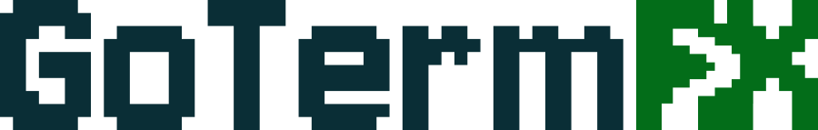
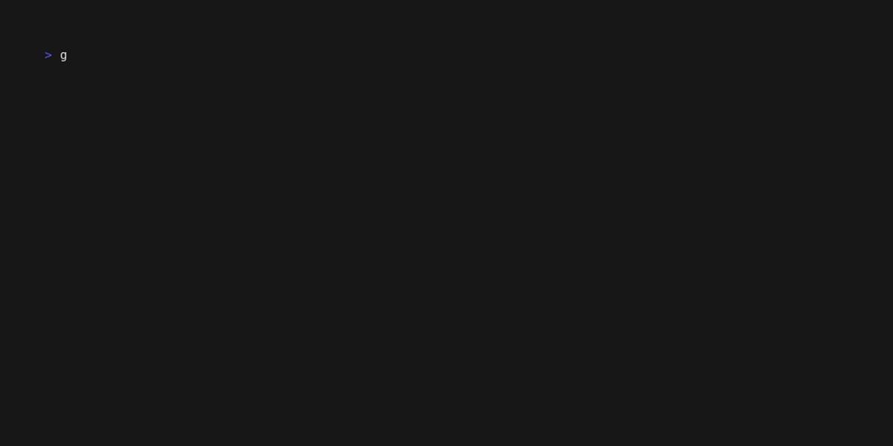
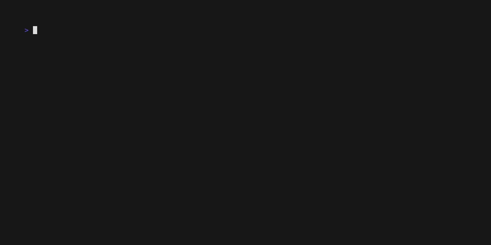
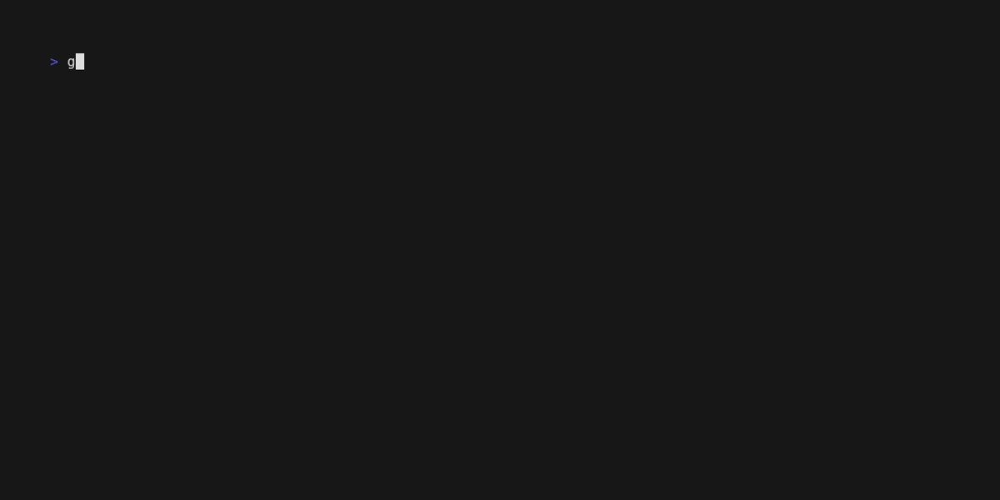

<div align="center">



# GoTermFX

**Terminal animations for people who spend too much time in the terminal.**


[](https://go.dev)
[](LICENSE)
[](https://goreportcard.com/report/github.com/mohamedation/gotermfx)

</div>

---

GoTermFX is a zero-dependency terminal animation CLI written in Go. Rain, matrix, fireworks, hyperspace, snow — all running directly in your terminal, all cancellable with a single keypress. You can also drop in your own animations with about 10 lines of Go.

## Install

```bash
go install github.com/mohamedation/gotermfx@latest
```

Or grab a binary from the [releases page](https://github.com/mohamedation/gotermfx/releases).

### Build from source

```bash
git clone https://github.com/mohamedation/gotermfx.git
cd gotermfx
make build        # compiles to ./bin/gotermfx
make install      # installs to /usr/local/bin
make uninstall    # removes it
make clean        # removes ./bin
```

You can also run without installing:

```bash
make run                  # runs a random animation
make run ARGS=matrix      # run a specific one
```

## Usage

```bash
gotermfx                  # random animation
gotermfx matrix           # run a specific one
gotermfx -i               # interactive picker
gotermfx -1               # run once then exit
gotermfx -1 -d 5s         # with a max duration for animations with a sequence
gotermfx -h               # help
```

Press any key to stop.

## Animations

### Matrix
Classic. had to include it and cant forget about CMatrix which is one of the OG out there


---

### WarGHOST
WarGames is one of my fav movie. I had to include this.


ps. only a demo

---

### WikiDecrypt
Sneakers is also one of the best OG pentesters story. WikiDecrypt Fetches a random Wikipedia article and reveals it character by character, like in the movie and also like no-more-secrets by bartobri


---

### Hyperspace


---


### Rain



---

### Fireworks



---

### Snow


---

### Starfield



---


## Add Your Own

The whole thing is built around a single interface:

```go
type Animation interface {
    Run(ctx context.Context)
}
```

Create a file in `animations/`, implement `Run`, register it in `init`, and it shows up automatically:

```go
package animations

import (
    "context"
    "gotermfx/termfx"
)

type myAnimation struct{}

func (a *myAnimation) Run(ctx context.Context) {
    for {
        select {
        case <-ctx.Done():
            return
        default:
            // draw something
        }
    }
}

func init() {
    termfx.Register("MyAnimation", &myAnimation{})
}
```

PRs welcome.

## License

MIT — do whatever you want with it.
